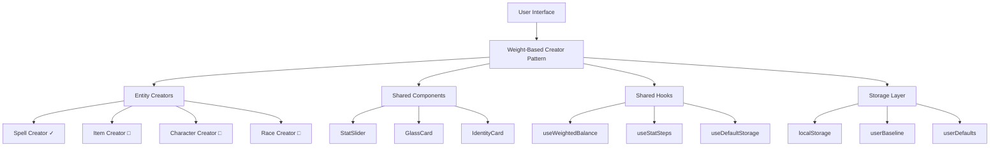
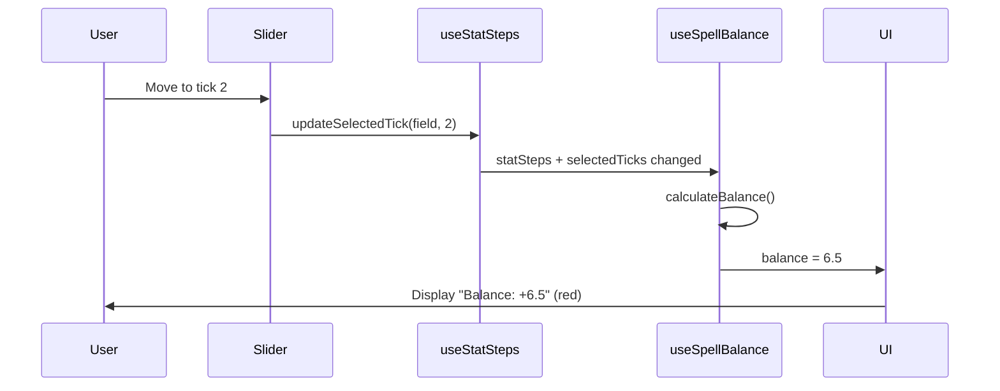
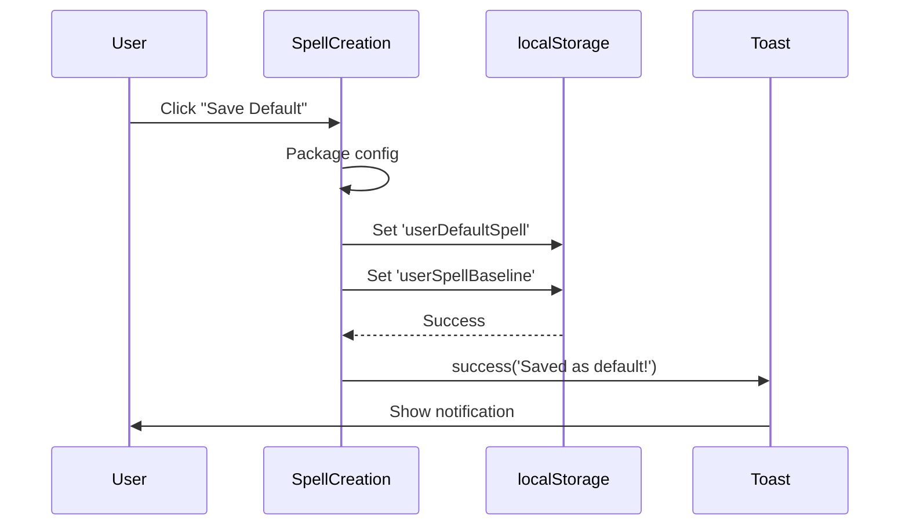

# RPG Balancer - Technical Architecture

## System Overview



## Component Architecture

### Current State: SpellCreation

```
SpellCreation (380 lines)
├─ State Management
│  ├─ spell: Spell
│  ├─ statSteps: Record<string, Tick[]>
│  ├─ selectedTicks: Record<string, number>
│  ├─ statOrder: string[]
│  ├─ collapsedStats: Set<string>
│  └─ targetBudget: number
│
├─ Logic
│  ├─ calculateBalance() → CORE LOGIC
│  ├─ getCustomWeights()
│  ├─ getUserBaseline()
│  ├─ handleSaveDefault()
│  └─ updateField()
│
└─ Sub-Components
   ├─ SpellIdentityCard
   ├─ StatsGrid
   │  └─ EnhancedStatSlider (x10)
   ├─ SpellInfoForm
   └─ ActionsBar
```

### Target State: Refactored

```
SpellCreationFeature/
├─ SpellCreation.tsx (150 lines)
│  └─ Orchestrator only
│
├─ components/
│  ├─ SpellIdentityCard/
│  │  ├─ index.tsx
│  │  └─ styles.module.css
│  │
│  ├─ EnhancedStatSlider/
│  │  ├─ index.tsx
│  │  ├─ StatSliderHeader.tsx
│  │  ├─ StatSliderTrack.tsx
│  │  ├─ StatSliderTick.tsx
│  │  └─ styles.module.css
│  │
│  └─ StatsGrid/
│     ├─ index.tsx
│     └─ useStatOrder.ts
│
├─ hooks/
│  ├─ useSpellBalance.ts        ← EXTRACTED
│  ├─ useSpellStorage.ts        ← EXTRACTED
│  └─ useStatSteps.ts           ← EXTRACTED
│
└─ utils/
   ├─ calculateBalance.ts       ← EXTRACTED
   └─ damageFormulas.ts         ← NEW
```

## Data Flow Between Zustand Store, TimeEngine, and Tauri File System

### Overview

The RPG Balancer uses a layered architecture with clear separation of concerns for the Idle Village meta-game:
- **UI Layer**: React components using Zustand stores
- **Domain Layer**: Pure business logic (TimeEngine, Balancing modules)
- **Persistence Layer**: Tauri File System integration

### 1. Zustand Stores

Zustand stores manage application state and provide React hooks for UI components.

#### IdleVillageConfigStore
- **Purpose**: Manages Idle Village configuration with validation, history, and persistence
- **Key Features**:
  - Config validation using Zod schemas
  - Undo/redo with 10-snapshot history
  - Debounced persistence to disk (1s delay)
  - Lazy initialization from disk or defaults
- **Data Flow**:
  - Loads config from `PersistenceService.loadFinalConfigFromDisk()`
  - Saves config via `PersistenceService.persistConfigToDisk()` with debounce
  - Provides hooks: `useIdleVillageConfigStore()`

#### VillageStateStore
- **Purpose**: Manages runtime Idle Village game state
- **Data Flow**:
  - Integrates with TimeEngine for state mutations
  - Persists game saves (if implemented)

### 2. TimeEngine

The TimeEngine is a pure domain module handling all time-based logic for the Idle Village meta-game.

#### Key Responsibilities
- **Activity Scheduling**: Queue and manage activities with start/end times
- **Time Advancement**: Progress simulation time, process completed activities
- **Trial of Fire**: Handle survival mechanics and stat bonuses
- **Resource Management**: Track food consumption, fatigue recovery
- **Quest System**: Generate and manage quest offers

#### Data Flow
```
UI Action → Zustand Store → TimeEngine Function → Updated State → UI Re-render
```

- **Input**: `TimeEngineDeps` (config, rng) + current `VillageState`
- **Output**: Updated `VillageState` + side effects (events)
- **Pure Functions**: All operations are deterministic given inputs

### 3. Tauri File System

Tauri provides secure file system access for persistence.

#### PersistenceService
- **loadFinalConfigFromDisk()**: Loads config from app data directory
- **persistConfigToDisk()**: Saves config to JSON file
- **File Location**: Platform-specific app data directory

#### Data Flow
```
Zustand Store → PersistenceService → Tauri FS API → Disk
Disk → Tauri FS API → PersistenceService → Zustand Store
```

### Integration Points

#### Config-First Architecture
- All domain logic reads from `IdleVillageConfig` (loaded from Zustand store)
- TimeEngine receives config via `TimeEngineDeps`
- Changes to config trigger re-evaluation of domain logic

#### State Management
- **Static Config**: Managed by `IdleVillageConfigStore`, persisted to disk
- **Runtime State**: Managed by `VillageStateStore`, may be persisted separately
- **Separation**: Config changes don't affect running game state

#### Validation & Safety
- Zod schemas validate all config mutations
- TimeEngine uses defensive programming (clamp01, finite checks)
- Persistence includes error handling and fallbacks

#### Example Flow: Scheduling an Activity

1. **User Interaction**: Player assigns residents to a quest slot
2. **UI Layer**: Component calls `scheduleActivity()` from Zustand store
3. **Domain Layer**: TimeEngine validates characters, calculates duration, updates state
4. **Persistence**: If config changed, debounced save to disk
5. **UI Update**: Store state change triggers re-render

#### Key Files

- `src/engine/game/idleVillage/TimeEngine.ts` - Core time logic
- `src/balancing/config/idleVillage/IdleVillageConfigStore.ts` - Config store
- `src/balancing/config/idleVillage/PersistenceService.ts` - FS integration
- `src/ui/idleVillage/useVillageStateStore.ts` - Runtime state store

### Balance Calculation Flow


### Save Default Flow


## Key Abstractions

### 1. WeightBasedCreator (Generic)

```typescript
interface WeightBasedCreatorProps<T> {
  // Entity being created
  entity: T;
  
  // Stat definitions
  statDefinitions: StatDefinition[];
  
  // Tick configurations
  defaultSteps: Record<string, Tick[]>;
  
  // Balance calculation function
  calculateBalance: (
    entity: T, 
    weights: Record<string, number>, 
    baseline: Partial<T>
  ) => number;
  
  // Callbacks
  onSave: (entity: T) => void;
  onReset: () => void;
}

interface StatDefinition {
  field: string;
  label: string;
  description: string;
  isMalus: boolean;
  defaultTicks: Tick[];
}

interface Tick {
  value: number;
  weight: number;
}
```

### 2. useWeightedBalance Hook

```typescript
export const useWeightedBalance = <T,>(
  entity: T,
  statSteps: Record<string, Tick[]>,
  selectedTicks: Record<string, number>,
  targetCost: number,
  statFields: string[]
): {
  balance: number;
  totalWeight: number; // For display purposes
  isBalanced: boolean;
} => {
  return useMemo(() => {
    const totalWeight = statFields.reduce((sum, field) => {
      const steps = statSteps[field];
      if (!steps || steps.length === 0) return sum;
      
      const idx = selectedTicks[field] || 0;
      const tick = steps[idx];
      return sum + (tick?.weight || 0);
    }, 0);
    
    const balance = totalWeight - targetCost;
    const isBalanced = Math.abs(balance) <= 1;
    
    return { balance, totalWeight, isBalanced };
  }, [entity, statSteps, selectedTicks, targetCost]);
};
```

### 3. useStatSteps Hook

```typescript
export const useStatSteps = (
  initialSteps: Record<string, Tick[]>
): {
  statSteps: Record<string, Tick[]>;
  selectedTicks: Record<string, number>;
  updateStep: (field: string, idx: number, tick: Tick) => void;
  addStep: (field: string, afterIdx: number) => void;
  removeStep: (field: string, idx: number) => void;
  selectTick: (field: string, idx: number) => void;
} => {
  // Implementation
};
```

## CSS Architecture

### Design Token System

```css
/* tokens.css */
:root {
  /* Glassmorphism */
  --glass-bg: rgba(255, 255, 255, 0.05);
  --glass-border: rgba(255, 255, 255, 0.1);
  --glass-blur: 12px;
  --glass-shadow: 0 4px 16px rgba(0, 0, 0, 0.3);
  
  /* Colors - Identity (Cyan) */
  --color-identity-bg: rgba(6, 182, 212, 0.2);
  --color-identity-border: rgba(6, 182, 212, 0.3);
  --color-identity-text: #06b6d4;
  --color-identity-glow: rgba(6, 182, 212, 0.6);
  
  /* Colors - Stats (Purple) */
  --color-stats-bg: rgba(168, 85, 247, 0.2);
  --color-stats-border: rgba(168, 85, 247, 0.3);
  --color-stats-text: #a855f7;
  --color-stats-glow: rgba(168, 85, 247, 0.6);
  
  /* Balance States */
  --color-balanced: #34d399;
  --color-over-budget: #f87171;
  --color-under-budget: #fbbf24;
}
```

### Component-Specific Styles (CSS Modules)

```css
/* EnhancedStatSlider/styles.module.css */
.container {
  @apply backdrop-blur-md bg-white/5 rounded-lg border border-white/10;
  box-shadow: var(--glass-shadow);
  transition: all 0.3s ease;
}

.container.collapsed {
  @apply flex-grow-0 basis-auto;
}

.sliderThumb {
  width: 20px;
  height: 20px;
  border-radius: 50%;
  background: linear-gradient(135deg, #60a5fa 0%, #3b82f6 100%);
  box-shadow: 
    0 0 12px rgba(59, 130, 246, 0.6),
    0 0 20px rgba(59, 130, 246, 0.4);
  border: 2px solid #ffffff;
  transition: all 0.2s ease;
}

.sliderThumb:hover {
  transform: scale(1.15);
  box-shadow: 
    0 0 16px rgba(59, 130, 246, 0.8),
    0 0 28px rgba(59, 130, 246, 0.6);
}
```

## Storage Schema

### localStorage Keys

```typescript
// User configuration
'userDefaultSpell': {
  spell: Spell,
  statOrder: string[],
  collapsedStats: string[],
  statSteps: Record<string, Tick[]>
}

// Balance baseline
'userSpellBaseline': Spell

// UI preferences
'spellCollapsedStats': string[]

// Saved spells
'idle_combat_spells': Spell[]
```

## Performance Considerations

### Current Bottlenecks
1. **Large Component Re-renders:** SpellCreation re-renders on ANY state change
2. **Inline Functions:** New functions created on every render
3. **Complex Calculations:** Balance re-calculated without memoization (recently fixed)

### Optimization Strategy
```typescript
// 1. Memoize expensive calculations
const balance = useMemo(() => calculateBalance(), [deps]);

// 2. Split components to reduce re-render scope
const StatSlider = memo(EnhancedStatSlider);

// 3. Extract stable callbacks
const handleSave = useCallback(() => {
  // ...
}, [deps]);

// 4. Lazy load heavy components
const SpellLibrary = lazy(() => import('./SpellLibrary'));
```

## Testing Strategy

### Unit Tests
```typescript
describe('useWeightedBalance', () => {
  it('calculates balance correctly', () => {
    const result = renderHook(() => useWeightedBalance(...));
    expect(result.current.balance).toBe(6.5);
  });
});
```

### Integration Tests
```typescript
describe('SpellCreation', () => {
  it('updates balance when slider moves', () => {
    render(<SpellCreation />);
    fireEvent.change(screen.getByRole('slider'), {target: {value: 2}});
    expect(screen.getByText(/Balance:/)).toHaveTextContent('+6.5');
  });
});
```

### E2E Tests (Playwright)
```typescript
test('create and save spell', async ({ page }) => {
  await page.goto('/spell-creation');
  await page.fill('[name="spellName"]', 'Fireball');
  await page.getByRole('slider', {name: 'effect'}).fill('2');
  await page.click('button:has-text("Save Spell")');
  await expect(page.locator('.toast')).toContainText('saved');
});
```

## Migration Path

### Phase 1: Notifications (No Breaking Changes)
- Add Sonner
- Replace alerts
- **Risk: Low**

### Phase 2: Extract Hooks (Refactor)
- useWeightedBalance
- useStatSteps
- **Risk: Medium** (logic changes)

### Phase 3: Component Restructure (Major Refactor)
- Break down EnhancedStatSlider
- Extract CSS to modules
- **Risk: High** (UI changes, extensive testing needed)

### Phase 4: Generalize Pattern (New Feature)
- Create WeightBasedCreator
- Build Item Creator
- **Risk: Low** (new code, doesn't affect existing)

---

*Last Updated: 2024-11-27*  
*Version: 1.0*
