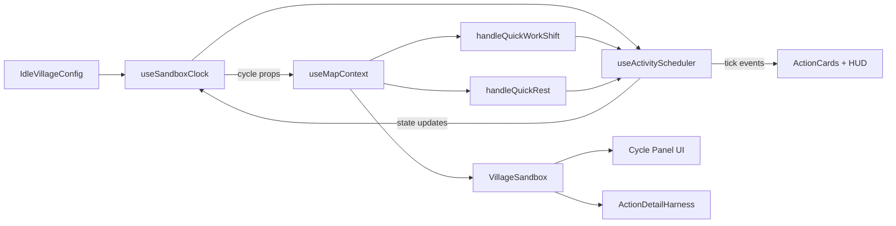

# Idle Village – ActionCard Architecture

> Fonte ufficiale per WS13+ e per qualsiasi modifica a `src/ui/idleVillage/**`.

## 1. ActionCard Base

- **Componente**: `ActionCardBase` (derivato da `ActivityActionCard`).
- **UI minima**: cerchio centrale, halo progressivo, icona configurabile, countdown (elapsed/remaining).
- **Tokens**: `variantTokens[verbVariant]` (job/quest/danger/maintenance) definiti via StyleLab.
- **Interazioni**: `useActionCardInteractions` gestisce hover, bloom, drag enter/leave, drop, click.
- **Props fondamentali**:
  - `variant` (compact/detail)
  - `riskPercentages`
  - `resolutionMode` (`tick` | `final`)
  - `slotDefinitions: ActionSlotDefinition[]`
  - `lockAssignmentsDuringRun` (per attività “final reward”)

## 2. Slot Model

- Ogni ActionCard dichiara gli slot via config:

  ```ts
  type ActionSlotDefinition = {
    id: string;
    capacity: number | 'infinite';
    requirements?: {
      statTags?: string[];
      fatigueMax?: number;
      crewLimit?: number;
    };
    modifiers?: {
      rewardMultiplier?: number;
      injuryModifier?: number;
    };
  };
  ```

- UI: `ActionSlotCard` (mini-variant dell’ActionCard) con gli stessi stati drag/drop e portrait assegnati.
- Stato residenti sincronizzato con `useVillageStateStore`:
  - Dragging → portrait alpha.
  - Assigned → status `away`.
  - Removal/completamento (non continuo) → torna `available`.
- **Magic-card parity (2026-01-02)**:
  1. `ActivityCardDetail` agisce come “carta sul tavolo” completa:
     - Start CTA disabilitato se gli slot richiesti sono vuoti (deriva da `ResidentSlotController.warnings`).
     - Rack drag/drop inoltrati via `onDropResident`/`onRemoveResident` (coperti in `ActivityCardDetail.test.tsx`).
     - Risk stripe verticale derivato da `deriveTheaterRiskStripes` con `data-*` alignment per Playwright/RTL.
  2. `LocationDetail` propaga le stesse regole alle verb cards:
     - Tutte le verb card passano per `ActivityActionCard` quindi condividono risk stripes, hero badge e drag/drop guardrails.
     - I job cards (modalità theater) usano ancora `ActivityActionCard` variante `detail` con CTA “Apri”.
     - Test RTL (`LocationDetail.test.tsx`) con mock `ActivityActionCardProps` verificano forwarding di `onVerbDrop`, hero badge e risk stripes.
  3. Documentazione aggiornata: questa sezione funge da indice per le regression suite "Magic-card".

Screenshots captured of ActionDetailHarness states for Punch Club preset (2026‑01‑03 parity rerun):

- Idle state: `docs/ui_regressions/activity-cards-idle.png`
- Valid drop (pc-trainee-1 assigned): `docs/ui_regressions/activity-cards-valid.png`
- Invalid drop (ws11-resident-2 dragging): `docs/ui_regressions/activity-cards-invalid.png`
Seed: Punch Club Light deterministic residents via `window.__idleVillageTestHooks.seedResidents(TEST_RESIDENTS)`.

## Magic-card parity evidence

**Seed used:** Punch Club light preset with seeded residents via `window.__idleVillageTestHooks.seedResidents(TEST_RESIDENTS)` (pc-trainee-1, pc-ring-anchor, ws11-resident-2, ws11-resident-3).

**Capture Success (2026‑01‑03 14:10 CET):** `npx playwright test tests/activity-cards-parity.spec.ts --project "Desktop Chrome"` passed with diagnostic logs (`[SandboxDragController] drop-state-update`) proving `slotDropStates` propagate to `useActionDetailHarness`. Compatible resident: pc-trainee-1 (`punch_gym`). Incompatible resident: ws11-resident-2 (nessun tag richiesto).

JSON snippet (valid state): `{"dropState":"valid","slotId":"job_punch_training","isPlaying":false,"showBloom":true}`

### 2.2 Magic-card parity (2026-01-02)

ActionDetailHarness captures and validates three drop states for `ActivityCardDetail`/`LocationDetail` parity:

**Idle State (no resident dragging):**

- Screenshot: `docs/ui_regressions/activity-cards-idle.png`
- JSON Fragment:

  ```json
  {
    "slotId": null,
    "dropState": "idle",
    "isPlaying": false
  }
  ```

**Valid Drop State (compatible resident dragging):**

- Screenshot: `docs/ui_regressions/activity-cards-valid.png`
- JSON Fragment:

  ```json
  {
    "slotId": "job_punch_training",
    "dropState": "valid",
    "isPlaying": false,
    "showBloom": true
  }
  ```

**Invalid Drop State (incompatible resident dragging):**

- Screenshot: `docs/ui_regressions/activity-cards-invalid.png`
- JSON Fragment:

  ```json
  {
    "dropState": "invalid",
    "isPlaying": false,
    "progressFraction": 0,
    "elapsedSeconds": 0,
    "totalDurationSeconds": 2,
    "elapsedLabel": "0:00",
    "remainingLabel": "0:02",
    "remainingSeconds": 2,
    "showBloom": false
  }
  ```

**Test Setup**: Uses Punch Club Light preset with seeded residents (Lucia “Lantern” Bassi / pc-trainee-1 con tag `punch_gym` per stato valido, Archivist/`ws11-resident-2` per invalid). Captured via Playwright `tests/activity-cards-parity.spec.ts` sfruttando i test hook `seedVillageSandbox`, `seedPunchClubResidents`, `setDraggingResidentId`, `getActionDetailHarnessState`. Log console conservano `slotDropStates` e `dropState` calcolati per commit b8d5736.

## 3. Quest Pipeline

- **Definizione**: `QuestDefinition` contiene `QuestPhase[]`.
  
  ```ts
  type QuestPhaseType = 'check' | 'fight' | 'stealth' | 'trap' | 'explore' | 'dialogue' | 'branch' | 'timedChoice';
  ```

  **Phase types:**
  - `check`: Ispezione/intelligence gathering (es. Scout Tunnels) - **amethyst**
  - `fight`: Combattimento diretto (es. Crush Brood, Skirmish Wolves) - **ember**
  - `stealth`: Operazioni furtive (es. Recover Cache) - **amethyst**
  - `trap`: Preparazione meccanismi/difese (es. Seal Vents) - **jade**
  - `explore`: Esplorazione/perlustrazione (es. Perimeter Exploration) - **amethyst**
  - `dialogue`: Scelte narrative che influenzano il branching (es. "Parla con il capo villaggio") - **azure**
  - `branch`: Logica condizionale automatica basata su stats/stato (es. "Se stat > 10 vai a successo") - **solar**
  - `timedChoice`: Decisioni sotto pressione temporale (es. "Hai 30 secondi per scegliere") - **azure**

  **Branching System:**
  - `DialoguePhase`: Presenta scelte al giocatore con `DialogueChoice[]`, ogni scelta porta a `BranchOutcome`
  - `BranchPhase`: Condizioni automatiche (`BranchCondition`) valutate deterministicamente
  - `TimedChoicePhase`: Scelte con time limit, timeout porta a outcome alternativo
  - `BranchOutcome`: Definisce `nextPhaseIds[]` (supporta multi-path), `effects[]`, `metadata`
  - Deterministico via LCG seeding per replayability e testing

- **Phase Sequence Visualization**:
  - Su ActionCard (compact/detail), LocationDetail, ActiveActivityHUD.
  - Display: "Phase X/Y: [Type]" sotto il nome assegnato (es. "Phase 2/3: Fight").
  - Solo per quest (`isQuest = true`), con `currentPhaseIndex`, `totalPhases`, `currentPhaseType` da config/QuestEngine.
  - Styling: testo piccolo uppercase amber-300/80, tracking 0.2em.

- **Heroic Feedback**: Badge "🏆 Heroic" mostrato quando:
  - Fase completata con successo (`result === 'success'`)
  - Fase aveva `heroicMetadata.hasDeathRisk: true`
  - Almeno un residente assegnato è sopravvissuto
  - Visualizzato in HUD (`ActiveActivityHUD`) e LocationDetail per quest completate
  - Styling: badge con border amber-400/60, bg amber-500/20, text amber-200, icon trophy.

- Timer:
  - `expireAt` opzionale (quest sparisce se non avviata in tempo).
  - Timer andata/ritorno pianificato ma non implementato in Sandbox v1.

- **Blueprint Extensions**: Aggiunto `heroicMetadata` per fase con:
  - `hasDeathRisk`: flag per fasi pericolose
  - `deathRiskThreshold`: minimo rischio morte per heroic feedback

### Telemetry Badges

ActivityActionCard supports optional telemetry badges for displaying quest analytics:

```typescript
telemetryBadges?: {
  recentChoice?: string;     // Shows last choice made (💭 icon)
  branchCount?: number;      // Shows total branches taken (🔀 icon)
  avgChoiceTime?: number;    // Average decision time
}
```

**Visual Design:**

- **Recent Choice**: Blue badge with 💭 icon, truncated text
- **Branch Count**: Purple badge with 🔀 icon, numeric display
- **Heroic Badge**: Amber badge with 🏆 icon (existing)

Badges appear next to the progress bar in compact layout, providing real-time quest analytics feedback.

## 4. Sandbox Layout & Resource Bar

### 4.1 Sticky Header & Summary Strip

- Componenti: `VillageSandboxHeader` + `SummaryStrip`.
- Layout: header avvolto in card Gilded (`rounded-3xl bg-black/70`) con `position: sticky; top: 1rem; z-index: 30`. Garantisce visibilità costante di:

  1. Icona fase (Day/Night) + titolo “Village Sandbox”.
  2. Contatore giorno e label fase.
  3. Barra di progresso ciclo (0–100%) e percentuale testuale.
  4. Pulsante reset che richiama `handleResetSandboxState` (solo se disponibile).

- SummaryStrip: render desktop (`md:flex`) direttamente nell’header per oro/cibo/popolazione. Su mobile viene replicato in blocco dedicato (`md:hidden`) per mantenere la stessa fonte dati.
- Testing: `VillageSandboxHeader.test.tsx` copre rendering base e reset. Playwright `villageSandbox-drag-assign.spec.ts` deve verificare che l’header resti ancorato durante scroll + drag.

### 4.2 Resource Panel

- Componenti: `ResourcePanel` + `SummaryStrip`.
- Data source: Preferibilmente `items` derivati da `config.resources`. Support legacy props (`gold`, `food`, `population`, `*Rate`) per retrocompatibilità.
- Rendering: card compatta stile StyleLab con griglia 2-colonne, pill arrotondate per ogni risorsa, delta opzionale color-coded (verde = crescita, rosso = calo).
- Fallback Summary Strip: se `items` è vuoto, il pannello mostra `SummaryStrip` nella sezione inferiore per evitare divergenze di contenuto.
- Testing TODO: aggiungere RTL per percorso `items` custom e Playwright che confronti i valori tra ResourcePanel e SummaryStrip dopo modifiche runtime alle risorse.

### 4.3 Colonne Sandbox

- Contenitore principale: `max-w-6xl` con padding 24px; su desktop `grid-cols-[2fr_1fr]`, su mobile stack verticale.
- Colonna sinistra: roster drag rail, lane ActionCard, LocationCard corrente, trigger Theater (`LocationDetail`). Consuma hook `useSandboxDragController` per gli stati drop.
- Colonna destra: ActiveHUD, ResourcePanel, QuestTelemetryPanel, TradeRoutePanel, MigrationQueuePanel. Tutti questi moduli leggono dallo stesso scheduler store e non duplicano logica di calcolo risorse.
- Guardrail visivo: header sticky non deve spingere le colonne durante scroll; usare `min-h` coerenti e `gap-4`.

## 5. Quest Telemetry Dashboard

### Quest Telemetry System

### Overview

Real-time analytics dashboard for quest performance tracking and decision analytics. Displays aggregated statistics, quest type distribution heatmap, and recent decision history with Gilded Observatory styling.

> **Config-First Quest Taxonomy**  
> Quest telemetry never hardcodes categories. The resolver reads `config.questTypes`, which is authored under `src/balancing/config/idleVillage/questTypeDefaults.ts` (or user overrides). Each type declares `{priority, colorClass, icon, matchers[], isFallback}` so the UI (heatmap, breakdowns, badges) stays perfectly aligned with whatever taxonomy designers express in config. Tests reference the same config snapshot to avoid diverging label lists.

### Core Features

- **Performance Metrics**: Total quests, success rate, average duration, heroic moments
- **Quest Type Heatmap**: Mini bar chart showing distribution by quest type (combat, stealth, exploration, narrative)
- **Recent Decisions List**: Last 5 branch decisions with timestamps and choice details
- **Live Analytics**: Real-time updates with persistence via async localStorage

### UI Components

## QuestTelemetryPanel

- Header: "Quest Telemetry" title with live indicator (pulsing green dot)
- Grid: 2x2 performance metrics cards with colored backgrounds
- Heatmap: Quest type distribution bars with percentages
- Decisions List: Scrollable recent decisions with timestamps
- Footer: Total branches and average choice time statistics

## useQuestTelemetry Hook

- Async persistence via PersistenceService (Tauri FS + localStorage fallback)
- Debounced save (500ms) for performance
- Real-time aggregation of quest results
- Quest type extraction and statistics

### Data Flow

## Collection

- `useQuestTelemetry.recordQuestResult()` called after each quest completion
- Aggregates success rate, duration, branch decisions, heroic moments
- Quest type categorization (combat/stealth/exploration/narrative/mixed)

## Persistence

```typescript
// Async save with debouncing
const debouncedSave = useCallback(async (data) => {
  await saveData('quest-telemetry', data);
}, []);

// Load on mount
const loadedData = await loadData('quest-telemetry', []);
```

## Analytics

- Success rate calculation across all quest types
- Average choice time and branch frequency analysis
- Heroic moment tracking and correlation analysis
- Quest type performance comparison

### Integration Points

## QuestEngine Integration

```typescript
const { recordQuestResult } = useQuestTelemetry();

// After quest completion
recordQuestResult({
  questId: result.questId,
  success: result.success,
  durationSeconds: result.durationSeconds,
  branchDecisions: result.branchDecisions,
  telemetryData: result.telemetryData,
});
```

## UI Integration

```typescript
// In VillageSandbox or dedicated telemetry view
<QuestTelemetryPanel
  showHeatmap={true}
  showRecentDecisions={true}
  compact={false}
/>
```

### Quest Type Categories

- **Combat**: `questId.includes('fight')` or `questId.includes('combat')`
- **Stealth**: `questId.includes('stealth')` or `questId.includes('sneak')`
- **Exploration**: `questId.includes('explore')` or `questId.includes('search')`
- **Narrative**: `questId.includes('dialogue')` or `questId.includes('story')`
- **Mixed**: Default fallback category

### Performance Considerations

- **Debounced Persistence**: 500ms delay prevents excessive I/O during rapid quest completions
- **Data Limiting**: Recent quests capped at 10, branch decisions at 20
- **Async Loading**: Hook shows loading state during initial data load
- **Error Handling**: Graceful fallback to empty state on persistence failures

## 6. Location & Theater (LocationDetail)

- Location = contenitore di ActionCard quando la mappa è troppo densa.
- Bloom: se una card figlia accetterebbe il resident, anche la location deve mostrare bloom.
- `TheaterView` verrà rinominato `LocationDetail`. All’interno, le ActionCard si comportano come sulla mappa (click = apri detail, bloom, drag/drop).
- Test: scenario Playwright dedicato per aprire LocationDetail, assegnare residenti e verificare bloom aggregato.

### 6.1 Punch Club Coordination (2026-01-02)

In Punch Club sandbox (`activeShellPresetId === 'punch_club_light'`), Theater overlay and detail panels are mutually exclusive to avoid UI conflicts:

- Opening a detail panel automatically closes any active Theater overlay.
- Opening the Theater overlay automatically closes any open detail panels.
- This coordination is enforced in `useMapContext` via `useEffect` hooks gated by the Punch Club preset check.
- Playwright test: `tests/villageSandbox-theater.spec.ts` validates hover→theater→drop scenarios and mutual exclusion.

### 6.1 Wave 3 guardrail checklist (2026‑01‑02)

Per allineare plan e spec:

1. **Validator condivisi**
   - ✅ `locationDropValidators.ts`: espone `validateLocationDropIntent(slotId, residentId, scheduler)` con path `src/ui/idleVillage/validators/locationDropValidators.ts`.
   - ☐ `slotTelemetryValidator.ts`: normalizza `injuryPercentage`, `deathPercentage`, hero badge flag così LocationDetail, TheaterOverlay e QuestChronicle condividono gli stessi dati.

2. **Selector & hook obbligatori**
   - ✅ `mapSelectors.ts`: fornisce `resolveFeaturedActivity(slotId)` e leggerà da `config.activities`.
   - ✅ `useQuestChronicleBridge`: costruisce i dati per `QuestBranchDiagram`, richiamato da LocationDetail quando `questDefinition` è presente.

3. **Risk stripes**
   - ✅ `deriveTheaterRiskStripes(activity)` restituisce proporzioni verticali giallo/rosso per injury/death (richiamo diretto in `ActivityActionCard`).
   - ✅ La card espone sempre `data-injury-percent`, `data-death-percent`, `data-has-risk` sul nodo `data-testid="activity-risk-stripe"` così RTL/Playwright possono verificare i valori calcolati e restano allineati a Theater/Location.
   - ✅ I gradienti usano esclusivamente i tokens definiti nell'helper (`rgba(239,68,68,0.95)` e `rgba(252,211,77,0.95)`) e nessun componente deve ricreare logiche inline diverse dal helper.
   - ✅ `useTheaterController` è responsabile dei timer multi-hover: `handleLocationResidentDragEnter/Leave` tracciano gli slot contemporaneamente in hover e riutilizzano `scheduleHoverOpen`/debounce close condivisi, quindi LocationCard/ActivitySlot inoltrano soltanto gli eventi (nessun timer locale o `setTimeout` in MapPage).

4. **Test**
   - ✅ RTL: `LocationDetail.test.tsx`, `TheaterOverlay.test.tsx`, `useTheaterViewModels.test.ts`.
   - ✅ Playwright: `tests/villageSandbox-location-card.spec.ts`, `tests/villageSandbox-theater.spec.ts`, `tests/villageSandbox-quest.spec.ts`.

5. **Documentazione**
   - ✅ Ogni intervento deve aggiornare questa sezione, il plan Wave 3 e allegare log test (`test-results/villageSandbox-*.log`).

## 7. Hooks & Test Hooks

- Hook pubblici (guardrail):
  1. `useSandboxClock`
  2. `useSandboxDragController`
  3. `useSandboxDemoPanel`
  4. `useTheaterController`
- Test hooks (`window.__idleVillageTestHooks`):
  1. `seedResidents`
  2. `invokeDemoHandler`
  3. `advanceTimeUnits`
  4. `advanceTimeSeconds`
  5. `assignResidentToActivity`
  6. `getManagedActivityHandles`
  7. `getSlotAssignments`
  8. `getResidentRosterSnapshot`
  9. `getActivityDefinition`
  10. `getAssignmentDiagnostics`
  11. `getAssignmentFeedback`
  12. `getResourceSnapshot`
  13. `getActionDetailHarnessState`
  14. `getLocationSlotIds`
  15. `setDraggingResidentId`
  16. `getDraggingResidentId`
  17. `getLocationDropState`
  18. `getHudEntries`
  19. `seedTradeRoutes`
  20. `seedMigrationQueue`
  21. `getTradeRoutesSnapshot`
  22. `getShellPresetDiagnostics`
  23. `getSchedulerTelemetry`
- Questi hook sono parte del contratto “test harness”. Quando la lista cambia, aggiornare questa sezione, il plan (sezione 8.6) e rieseguire `npm run check:sandbox-docs`.

### Punch Club diagnostics

Per debuggare problemi specifici del preset Punch Club Light (`activeShellPresetId === 'punch_club_light'`), attivare diagnostica mirata:

- **`logPunchClubDiagnostics(page, label)`**: Cattura stato hook (`locationSlotIds`, `slotAssignments`, `actionDetailHarnessState`, `locationDropState`, `draggingResidentId`) in console con payload strutturato. Utile per verificare slot assignments, drag state e drop validation durante failure hook o navigazione. Chiamare dopo `seedVillageSandbox` o durante spec Punch Club per baseline diagnostica.
- **`getShellPresetDiagnostics()`**: Restituisce `activeShellPresetId`, opzioni preset disponibili e attività caricate. Utile per confermare preset attivato correttamente (dovrebbe essere `'punch_club_light'`) e debuggare perché job/quest Punch Club non appaiono.
- **Attivazione:** In spec Punch Club (`tests/punch-club-loop.spec.ts`) o fixture (`ensureActivityAreaPopulated`), chiamare dopo seeding o su errori hook. Non usare in produzione – solo test mode (`import.meta.env.MODE === 'test'`). Output: console logs + payload JSON per trace CI.

## 8. Game Loop “Fight Club Light”

- Ogni resident necessita cibo giornaliero, riposo e può allenarsi.
- Job/Activities forniscono risorse/allenamenti (tick o final reward).
- Ogni X giorni avviene un combattimento più difficile (fase successiva).
- Quest servono per progressione narrativa e power-up eroici.

## 9. Workstream Roadmap (sintesi)

| ID | Obiettivo | File chiave | Test |
| --- | --- | --- | --- |
| WS13 | Normalizzare ActionCard/slot e drag | `ActivityActionCard`, `ActionSlotCard`, config | RTL + Storybook + Playwright drag |
| WS14 | QuestEngine + QuestPhase types | `src/engine/quest/QuestEngine.ts` | Vitest unit |
| WS15 | LocationDetail (ex-Theater) | `TheaterView` → `LocationDetail` | RTL + Playwright location |

Questo documento va citato in ogni prompt relativo ad ActionCard/Quest/Location per garantire coerenza multi-sessione.

## 10. Sandbox Clock & Quick Action Shareline

### Clock ownership

- **Hook:** `useSandboxClock` è l'unica fonte di verità per:
  - Stato del ciclo giorno/notte (`cycleProgressFraction`, `cycleDayCount`, `cycleVariant`).
  - Scheduler condiviso (`activityScheduler`) che alimenta ActionCard, harness e test hooks (`advanceTimeUnits`).
  - Quick actions (`handleQuickWorkShift`, `handleQuickRest`) e pulsanti UI del Cycle Panel in `VillageSandbox.tsx`.
- **Consumatori:** `useMapContext` propaga le proprietà del clock a:
  1. `VillageSandboxHeader` → mostra stato ciclo e play/pause.
  2. `ActionDetailHarness` / `ActivityArea` → sincronizzano progress bar in base ai tick inviati da `subscribeClock`.
  3. Test hooks (`window.__idleVillageTestHooks`) → usano `advanceTimeUnits` per gli scenari Playwright.

### Diagramma (clock → quick actions → scheduler → UI)



### Quick Work / Rest rules

1. **Work Shift**
   - Sceglie `primaryJobActivity` dal config (nessun hardcode id slot).
   - Assegna un residente disponibile tramite `useSandboxDragController.handleWorkerDrop`.
   - Avanza il clock con `activityScheduler.advanceTimeUnitsDebug(durationUnits)` per simulare il turno rapido.
   - Propaga i cambiamenti risorse via `onResourcesChange` → `SummaryStrip`.

2. **Rest**
   - Mette in pausa il loop (`setIsCyclePlaying(false)` + `activityScheduler.pauseTimer()`).
   - Applica recupero fatica basato su `config.globalRules.fatigueRecoveryPerDay` proporzionato a `nightTimeUnits`.
   - Reset scheduler con stato aggiornato e riattiva con `resumeTimer` alla fine del riposo.

### Testing & hooks

- **RTL:** `useSandboxClock.test.ts` copre play/pause, notifiche ai subscriber e sincronizzazione quando il scheduler avanza tempo.
- **UI RTL:** `VillageSandbox.cycle.test.tsx` verifica ciclo panel + quick action buttons.
- **Playwright:** `tests/villageSandbox-drag-assign.spec.ts` e `tests/villageSandbox-roster.spec.ts` usano `__idleVillageTestHooks.advanceTimeUnits`.

> **Guardrail:** Non duplicare logiche dei quick actions fuori dai hook (`useSandboxClock`, `useMapContext`). Qualsiasi nuovo pannello che avanza il tempo deve iscriversi al clock condiviso o usare l'API test hook documentata.
