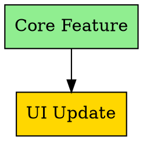
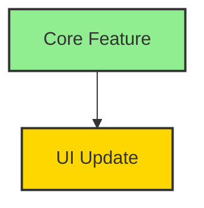

# Prompt Conflict Detector Documentation

## Overview

The Prompt Conflict Detector is a comprehensive CLI tool for analyzing Kanban prompt assignments and detecting conflicts that could impact workflow efficiency. It identifies file target overlaps, dependency cycles, agent overloads, and other issues that could cause bottlenecks or inconsistencies in the development process.

## Features

- **File Target Overlap Detection**: Identifies when multiple prompts target the same files
- **Dependency Cycle Analysis**: Detects circular dependencies that could cause deadlocks
- **Agent Overload Monitoring**: Tracks agent workload and prevents overallocation
- **Status Consistency Validation**: Ensures prompt statuses are consistent with requirements
- **Evidence Missing Detection**: Identifies completed prompts lacking proper evidence
- **Duplicate Prompt Detection**: Finds prompts with duplicate names or descriptions
- **Dependency Graph Visualization**: Generates visual representations of prompt dependencies
- **Multi-format Export**: JSON, Markdown, and CSV output options
- **Telemetry Integration**: Automatic event emission for analytics

## Architecture

### Core Components

#### PromptConflictRules
Main rules engine that implements all conflict detection algorithms with configurable thresholds and severity levels.

#### PromptConflictDetector CLI
Command-line interface that orchestrates the analysis process and generates reports.

#### Conflict Types
- **File Target Overlap**: Multiple prompts targeting the same file
- **Dependency Cycle**: Circular dependencies between prompts
- **Agent Overload**: Too many active prompts assigned to one agent
- **Status Inconsistency**: Status not matching requirements (e.g., completed without evidence)
- **Evidence Missing**: Required evidence not provided for completed prompts
- **Duplicate Prompt**: Multiple prompts with identical names

### Severity Levels

- **Critical**: Immediate action required (4 points)
- **High**: Should be addressed soon (3 points)
- **Medium**: Important but not urgent (2 points)
- **Low**: Minor issues (1 point)

## Usage Examples

### Basic Analysis
```bash
# Analyze Kanban for conflicts
npm run prompt-conflict-detector analyze

# Specify custom Kanban file
npm run prompt-conflict-detector analyze --kanban path/to/kanban.md

# Filter by minimum severity
npm run prompt-conflict-detector analyze --severity high

# Export to Markdown
npm run prompt-conflict-detector analyze --format markdown --output ./reports
```

### Validate Specific Prompt
```bash
# Validate single prompt for conflicts
npm run prompt-conflict-detector validate --prompt NP-101

# Validate with custom config
npm run prompt-conflict-detector validate --prompt NP-101 --config config.json
```

### Generate Dependency Graph
```bash
# Generate DOT graph for Graphviz
npm run prompt-conflict-detector graph --format dot

# Generate Mermaid graph
npm run prompt-conflict-detector graph --format mermaid --output deps.mmd
```

### Advanced Usage
```bash
# Full analysis with telemetry
npm run prompt-conflict-detector analyze \
  --kanban src/docs/docs/coordinator/agent_assignments.md \
  --format json \
  --severity medium \
  --telemetry \
  --output ./conflicts
```

## Configuration

### Default Configuration
```json
{
  "agentWorkloadLimit": 3,
  "fileTargetOverlapThreshold": 1,
  "dependencyCycleDepth": 10,
  "evidenceRequiredForStatus": ["Completato"],
  "ignorePatterns": [
    "*.md",
    "test-results/**",
    "node_modules/**",
    ".git/**"
  ],
  "severityWeights": {
    "critical": 4,
    "high": 3,
    "medium": 2,
    "low": 1
  }
}
```

### Custom Configuration
Create a custom configuration file and reference it:

```bash
npm run prompt-conflict-detector analyze --config custom-config.json
```

## Conflict Types Explained

### File Target Overlap
**When detected**: Multiple prompts target the same file
**Impact**: Potential merge conflicts and coordination issues
**Severity**: Based on number of overlapping prompts
**Recommendation**: Coordinate between agents or restructure file assignments

### Dependency Cycle
**When detected**: Circular dependencies between prompts
**Impact**: Deadlock situation where no prompt can start
**Severity**: Always High
**Recommendation**: Break the cycle by removing one dependency

### Agent Overload
**When detected**: Agent has more active prompts than the limit
**Impact**: Reduced efficiency and potential burnout
**Severity**: Based on overload level
**Recommendation**: Redistribute workload or wait for completion

### Status Inconsistency
**When detected**: Status doesn't match requirements
**Impact**: Incomplete tracking and potential policy violations
**Severity**: Varies by type
**Recommendation**: Update status or add missing information

### Evidence Missing
**When detected**: Completed prompt lacks evidence
**Impact**: KS-005 policy violation
**Severity**: High
**Recommendation**: Add evidence reference or update status

### Duplicate Prompt
**When detected**: Multiple prompts with identical names
**Impact**: Confusion and potential duplicate work
**Severity**: Medium
**Recommendation**: Rename prompts or merge if appropriate

## Report Formats

### JSON Report
Structured data format suitable for programmatic consumption:

```json
{
  "timestamp": "2026-01-21T22:30:00.000Z",
  "totalPrompts": 150,
  "totalConflicts": 5,
  "conflictScore": 12,
  "conflicts": [...],
  "summary": {
    "critical": 1,
    "high": 2,
    "medium": 1,
    "low": 1
  },
  "recommendations": [...],
  "dependencyGraph": {...}
}
```

### Markdown Report
Human-readable format with sections and formatting:

```markdown
# Prompt Conflict Detection Report

**Generated:** January 21, 2026, 10:30 PM
**Total Prompts:** 150
**Total Conflicts:** 5
**Conflict Score:** 12

## Summary
- **🔴 Critical:** 1
- **🟠 High:** 2
- **🟡 Medium:** 1
- **🟢 Low:** 1

## Conflicts by Type
### File Target Overlap
#### 🔴 Critical overlap detected in src/core.ts
**Severity:** critical
**Recommendation:** Coordinate between agents to avoid conflicts
**Affected Prompts:** NP-101, NP-102, NP-103, NP-104
```

### CSV Report
Tabular format suitable for spreadsheet analysis:

```csv
Prompt Conflict Detection Report
Generated,2026-01-21T22:30:00.000Z
Total Prompts,150
Total Conflicts,5
Conflict Score,12

Summary
Severity,Count
Critical,1
High,2
Medium,1
Low,1

Conflicts
Type,Severity,Description,Recommendation,Affected Items
file_target_overlap,critical,"Critical overlap detected","Coordinate","NP-101;NP-102"
```

## Dependency Graph Visualization

### DOT Format (Graphviz)


### Mermaid Format


## Integration Points

### KS-005 Policy Compliance
The detector helps maintain KS-005 policy compliance by:
- Ensuring completed prompts have proper evidence
- Monitoring agent workload limits
- Validating status consistency
- Providing detailed reports for coordinator review

### CI/CD Integration
```yaml
# GitHub Actions example
- name: Check for prompt conflicts
  run: |
    npm run prompt-conflict-detector analyze \
      --severity critical \
      --telemetry
    
    # Fail if critical conflicts found
    if [ $? -ne 0 ]; then
      echo "Critical conflicts detected - review required"
      exit 1
    fi
```

### Telemetry Events
The detector emits `coordinator_prompt_conflict_detected` events with:
```json
{
  "eventType": "coordinator_prompt_conflict_detected",
  "timestamp": "2026-01-21T22:30:00.000Z",
  "data": {
    "totalPrompts": 150,
    "totalConflicts": 5,
    "conflictScore": 12,
    "criticalConflicts": 1,
    "outputPath": "test-results/conflict-report.json"
  }
}
```

## Performance Characteristics

### Analysis Speed
- **Small Kanban** (<50 prompts): <1 second
- **Medium Kanban** (50-150 prompts): 2-5 seconds
- **Large Kanban** (150+ prompts): 5-10 seconds

### Memory Usage
- **Base memory**: ~10MB
- **Per prompt**: ~50KB additional memory
- **Large Kanban support**: Tested up to 500 prompts

### Dependency Graph Generation
- **DOT format**: <1 second for typical Kanban
- **Mermaid format**: <1 second for typical Kanban
- **Cycle detection**: O(V + E) complexity

## Troubleshooting

### Common Issues

#### No Conflicts Detected
If you expect conflicts but none are detected:
1. Check if file targets are properly formatted
2. Verify dependency syntax (comma-separated)
3. Ensure agent names match exactly
4. Check ignore patterns in configuration

#### False Positives
If you see false positive conflicts:
1. Review ignore patterns in configuration
2. Check if file paths are correctly specified
3. Verify dependency relationships are accurate

#### Performance Issues
If analysis is slow:
1. Reduce Kanban size by filtering completed prompts
2. Simplify ignore patterns
3. Check for circular dependencies manually

#### Export Errors
If export fails:
1. Verify output directory exists and is writable
2. Check file permissions
3. Ensure sufficient disk space

### Error Messages

#### "Prompt not found"
- Verify prompt ID exists in Kanban
- Check for exact spelling and formatting
- Ensure prompt ID follows NP-XXX pattern

#### "Could not load config"
- Verify configuration file path
- Check JSON syntax validity
- Ensure file is readable

#### "Critical conflicts detected"
- Review conflict report for details
- Address critical issues first
- Re-run analysis after fixes

## Best Practices

### Kanban Maintenance
1. **Consistent Naming**: Use clear, unique prompt names
2. **Proper Dependencies**: Avoid circular dependencies
3. **Complete Evidence**: Always add evidence for completed prompts
4. **Agent Balance**: Distribute workload evenly
5. **Regular Analysis**: Run conflict detection weekly

### Configuration Management
1. **Custom Thresholds**: Adjust limits based on team capacity
2. **Ignore Patterns**: Keep patterns up to date
3. **Severity Weights**: Calibrate based on team priorities
4. **Version Control**: Track configuration changes

### Workflow Integration
1. **Pre-commit Hooks**: Run conflict detection before commits
2. **CI Integration**: Automate conflict checking in pipelines
3. **Regular Reviews**: Schedule weekly conflict reviews
4. **Documentation**: Keep conflict resolution records

## API Reference

### PromptConflictRules Class

#### Constructor
```typescript
new PromptConflictRules(config?: ConflictDetectionConfig)
```

#### Methods

##### detectFileTargetOverlaps(prompts: Map<string, any>): FileTargetConflict[]
Detects when multiple prompts target the same files.

##### detectDependencyCycles(prompts: Map<string, any>): DependencyCycleConflict[]
Detects circular dependencies using DFS algorithm.

##### detectAgentOverload(prompts: Map<string, any>): AgentOverloadConflict[]
Detects when agents have too many active prompts.

##### detectStatusInconsistencies(prompts: Map<string, any>): StatusInconsistencyConflict[]
Detects status inconsistencies and stale prompts.

##### detectMissingEvidence(prompts: Map<string, any>): EvidenceMissingConflict[]
Detects completed prompts lacking evidence.

##### detectDuplicatePrompts(prompts: Map<string, any>): DuplicatePromptConflict[]
Detects prompts with duplicate names.

##### getConflictScore(conflicts: Conflict[]): number
Calculates weighted conflict score.

##### getConflictsBySeverity(conflicts: Conflict[]): Record<ConflictSeverity, Conflict[]>
Groups conflicts by severity level.

### CLI Commands

#### analyze
Analyze Kanban for conflicts and generate reports.

**Options:**
- `--kanban <path>`: Kanban file path (default: agent_assignments.md)
- `--output <path>`: Output directory (default: test-results)
- `--format <format>`: Output format (json|markdown|csv)
- `--severity <level>`: Minimum severity (low|medium|high|critical)
- `--config <path>`: Configuration file path
- `--telemetry`: Emit telemetry events

#### validate
Validate specific prompt for conflicts.

**Options:**
- `--prompt <id>`: Prompt ID to validate
- `--kanban <path>`: Kanban file path
- `--config <path>`: Configuration file path

#### graph
Generate dependency graph visualization.

**Options:**
- `--kanban <path>`: Kanban file path
- `--output <path>`: Output file path
- `--format <format>`: Graph format (dot|mermaid)

## Version History

### v1.0.0 (2026-01-21)
- Initial release with core conflict detection
- CLI tool with multiple export formats
- Dependency graph generation
- Telemetry integration
- Comprehensive documentation

## Future Enhancements

### Planned Features
- **Real-time Monitoring**: Continuous conflict detection
- **Auto-resolution**: Suggest automatic fixes for simple conflicts
- **Integration APIs**: REST API for programmatic access
- **Web Dashboard**: Visual interface for conflict management
- **Historical Analysis**: Track conflict trends over time

### API Stability
- Core detection algorithms: Stable
- CLI interface: Stable
- Configuration format: Stable
- Report formats: Stable

## Support

For issues and questions:
1. Check this documentation
2. Review test cases for usage examples
3. Consult the main coordinator documentation
4. Check existing GitHub issues

## License

Part of the RPG Balancer project. See project license for details.
