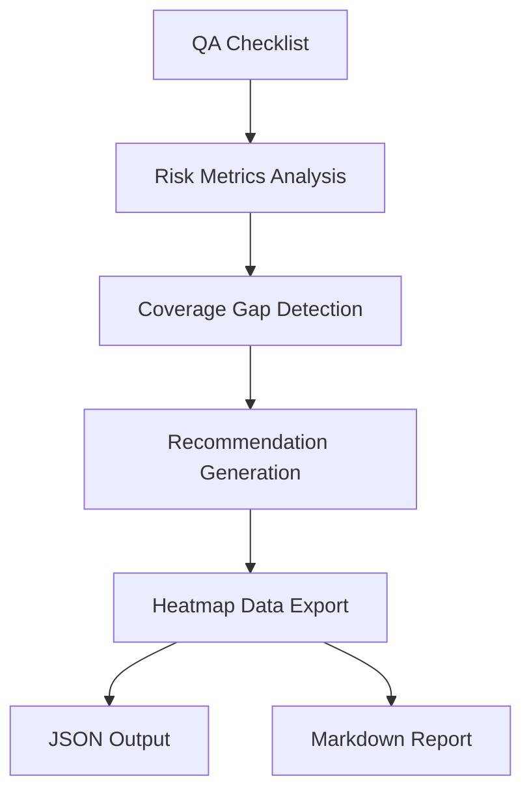

# Minimal Gameplay Risk Heatmap Export

This document describes the Minimal Gameplay Risk Heatmap Export system, which analyzes QA checklist data to generate comprehensive risk assessments and coverage gap analysis.

## Overview

The Risk Heatmap Export system takes QA checklist data as input and generates:

- **Risk Metrics:** Per-category risk analysis with coverage, priority distribution, and risk scores
- **Coverage Gaps:** Identification of testing gaps and automation opportunities
- **Actionable Recommendations:** Immediate, short-term, and long-term improvement suggestions
- **Executive Summary:** High-level risk overview for decision makers

## Architecture

### Risk Analysis Pipeline



### Risk Scoring Methodology

Risk scores are calculated using multiple weighted factors:

#### Risk Score Formula
```
Risk Score = (Coverage Factor × 40) + (Priority Factor × 35) + (Time Factor × 15) + (Category Factor × 10)
```

#### Factor Definitions

**Coverage Factor:** `(100 - coverage_percentage) / 100`
- Higher risk when coverage is lower
- 40% weight in final score

**Priority Factor:** Weighted sum of task priorities
- Critical: 1.0, High: 0.7, Medium: 0.4, Low: 0.1
- Normalized by total tasks
- 35% weight in final score

**Time Factor:** Complexity indicator
- Based on average task duration (capped at 30 minutes)
- 15% weight in final score

**Category Factor:** Domain-specific risk multipliers
- Mechanics: 1.2 (core gameplay)
- UI: 0.8 (visible but less critical)
- Locations: 1.0 (activity execution)
- Residents: 1.0 (stat mechanics)
- Performance: 1.1 (user experience)
- Edge Cases: 0.9 (important but rare)
- 10% weight in final score

#### Risk Level Mapping

| Risk Score | Level | Action Required |
|------------|-------|----------------|
| 75-100 | 🔴 Critical | Immediate attention required |
| 50-74 | 🟠 High | Address in next sprint |
| 25-49 | 🟡 Medium | Monitor and plan improvements |
| 0-24 | 🟢 Low | Acceptable risk level |

## CLI Usage

### Basic Usage

```bash
# Generate from existing QA checklist
tsx scripts/idleVillage/minimalRiskHeatmap.ts \
  --input-checklist qa-checklist.json \
  --output-heatmap risk-heatmap.json \
  --output-markdown risk-heatmap.md

# Generate checklist and heatmap together
tsx scripts/idleVillage/minimalRiskHeatmap.ts \
  --generate-checklist \
  --output-heatmap risk-heatmap.json \
  --output-markdown risk-heatmap.md

# Show help
tsx scripts/idleVillage/minimalRiskHeatmap.ts --help
```

### Command Line Options

| Option | Short | Description | Required |
|--------|-------|-------------|----------|
| `--input-checklist <file>` | `-i` | Input QA checklist JSON file | No* |
| `--generate-checklist` | `-g` | Generate QA checklist from current config | No* |
| `--output-heatmap <file>` | `-j` | Output risk heatmap in JSON format | No** |
| `--output-markdown <file>` | `-m` | Output risk heatmap in Markdown format | No** |
| `--verbose` | `-v` | Enable verbose logging | No |
| `--help` | `-h` | Show help message | No |

* Must specify either `--input-checklist` or `--generate-checklist`
** Must specify at least one output format

### Output Formats

#### JSON Output
Structured data for automation and integration:

```json
{
  "generatedAt": "2026-01-20T12:00:00.000Z",
  "checklistVersion": "0.1.0-minimal-gameplay",
  "overallRiskScore": 45.2,
  "overallCoverage": 65.8,
  "riskMetrics": [...],
  "coverageGaps": [...],
  "recommendations": {
    "immediate": [...],
    "shortTerm": [...],
    "longTerm": [...]
  },
  "summary": {
    "totalTasks": 25,
    "automatedTasks": 15,
    "criticalTasks": 5,
    "coveragePercentage": 65.8,
    "estimatedTotalTime": 450
  }
}
```

#### Markdown Output
Human-readable risk report with formatted tables and recommendations:

```markdown
# Minimal Gameplay Risk Heatmap

**Generated:** 1/20/2026, 12:00:00 PM
**Checklist Version:** 0.1.0-minimal-gameplay
**Overall Risk Score:** 45.2/100
**Overall Coverage:** 65.8%

## Executive Summary

- **Total Tasks:** 25
- **Automated Tasks:** 15 (60%)
- **Critical Tasks:** 5
- **Coverage:** 65.8%
- **Estimated Testing Time:** 7.5 hours

## Risk Overview

### Risk Level Distribution
| Risk Level | Categories | Description |
|------------|------------|-------------|
| 🔴 Critical | 1 | Immediate attention required |
| 🟠 High | 2 | Address in next sprint |
| 🟡 Medium | 1 | Monitor and plan improvements |
| 🟢 Low | 2 | Acceptable risk level |
```

## API Reference

### Core Functions

#### `generateRiskHeatmap(checklist)`

Analyzes QA checklist data and generates comprehensive risk heatmap.

**Parameters:**
- `checklist`: `QAChecklistReport` - QA checklist data from generator

**Returns:** `RiskHeatmapData` - Complete risk analysis with metrics and recommendations

**Example:**
```typescript
import { generateRiskHeatmap } from '@/balancing/config/idleVillage/riskHeatmapExport';
import { generateQAChecklist } from '@/balancing/config/idleVillage/qaChecklistGenerator';
import { MINIMAL_GAMEPLAY_CONFIG } from '@/balancing/config/idleVillage/minimalGameplayConfig';

const checklist = generateQAChecklist(MINIMAL_GAMEPLAY_CONFIG);
const heatmap = generateRiskHeatmap(checklist);

console.log(`Overall risk: ${heatmap.overallRiskScore.toFixed(1)}/100`);
console.log(`Coverage gaps: ${heatmap.coverageGaps.length}`);
```

### Type Definitions

#### `RiskMetric`
```typescript
interface RiskMetric {
  category: 'ui' | 'mechanics' | 'locations' | 'residents' | 'performance' | 'edge-cases';
  riskLevel: 'low' | 'medium' | 'high' | 'critical';
  coverage: number;                    // 0-100 percentage
  taskCount: number;                   // Total tasks in category
  automatedCount: number;              // Number of automated tasks
  priorityBreakdown: {
    critical: number;
    high: number;
    medium: number;
    low: number;
  };
  averageTimeMinutes: number;          // Average task duration
  riskScore: number;                   // Calculated risk score 0-100
  recommendations: string[];           // Category-specific recommendations
}
```

#### `CoverageGap`
```typescript
interface CoverageGap {
  gapId: string;                       // Unique gap identifier
  category: string;                    // Affected category
  severity: 'minor' | 'moderate' | 'major' | 'critical';
  description: string;                 // Gap description
  affectedTasks: number;               // Number of affected tasks
  estimatedImpact: string;             // Impact assessment
  mitigationSuggestions: string[];     // Suggested fixes
}
```

#### `RiskHeatmapData`
```typescript
interface RiskHeatmapData {
  generatedAt: string;                 // ISO timestamp
  checklistVersion: string;            // Source checklist version
  overallRiskScore: number;            // Aggregate risk score 0-100
  overallCoverage: number;             // Aggregate coverage percentage
  riskMetrics: RiskMetric[];           // Per-category risk analysis
  coverageGaps: CoverageGap[];         // Identified coverage gaps
  recommendations: {
    immediate: string[];               // Actions needed this week
    shortTerm: string[];               // Actions for next 1-2 weeks
    longTerm: string[];                // Strategic improvements
  };
  summary: {
    totalTasks: number;                // Total QA tasks
    automatedTasks: number;            // Number of automated tasks
    criticalTasks: number;             // Number of critical tasks
    coveragePercentage: number;        // Overall automation coverage
    estimatedTotalTime: number;        // Total testing time estimate
  };
}
```

## Integration Examples

### CI/CD Pipeline Integration

```yaml
# .github/workflows/risk-analysis.yml
name: Risk Analysis

on:
  push:
    paths:
      - 'src/balancing/config/idleVillage/minimalGameplayConfig.ts'

jobs:
  risk-analysis:
    runs-on: ubuntu-latest
    steps:
      - uses: actions/checkout@v3
      - uses: actions/setup-node@v3
        with:
          node-version: '18'
      - run: npm ci

      # Generate QA checklist
      - run: npx tsx scripts/idleVillage/minimalQAChecklist.ts \
          --generate-checklist \
          --output-json qa-checklist.json

      # Generate risk heatmap
      - run: npx tsx scripts/idleVillage/minimalRiskHeatmap.ts \
          --input-checklist qa-checklist.json \
          --output-heatmap risk-heatmap.json \
          --output-markdown risk-heatmap.md

      # Check risk thresholds
      - run: |
          RISK_SCORE=$(jq '.overallRiskScore' risk-heatmap.json)
          if [ "$RISK_SCORE" -gt 75 ]; then
            echo "🚨 Critical risk detected: $RISK_SCORE/100"
            exit 1
          fi

      - uses: actions/upload-artifact@v3
        with:
          name: risk-analysis
          path: |
            qa-checklist.json
            risk-heatmap.json
            risk-heatmap.md
```

### Automated Test Integration

```typescript
// tests/risk-monitoring/riskThresholds.test.ts
import { generateRiskHeatmap } from '@/balancing/config/idleVillage/riskHeatmapExport';
import { generateQAChecklist } from '@/balancing/config/idleVillage/qaChecklistGenerator';
import { MINIMAL_GAMEPLAY_CONFIG } from '@/balancing/config/idleVillage/minimalGameplayConfig';

describe('Risk Threshold Monitoring', () => {
  it('should not exceed critical risk threshold', () => {
    const checklist = generateQAChecklist(MINIMAL_GAMEPLAY_CONFIG);
    const heatmap = generateRiskHeatmap(checklist);

    expect(heatmap.overallRiskScore).toBeLessThanOrEqual(75);
  });

  it('should maintain minimum coverage levels', () => {
    const checklist = generateQAChecklist(MINIMAL_GAMEPLAY_CONFIG);
    const heatmap = generateRiskHeatmap(checklist);

    expect(heatmap.overallCoverage).toBeGreaterThanOrEqual(50);
  });

  it('should not have critical coverage gaps', () => {
    const checklist = generateQAChecklist(MINIMAL_GAMEPLAY_CONFIG);
    const heatmap = generateRiskHeatmap(checklist);

    const criticalGaps = heatmap.coverageGaps.filter(gap => gap.severity === 'critical');
    expect(criticalGaps.length).toBe(0);
  });
});
```

### Dashboard Integration

```typescript
// src/components/RiskDashboard.tsx
import { useEffect, useState } from 'react';
import { generateRiskHeatmap } from '@/balancing/config/idleVillage/riskHeatmapExport';
import { generateQAChecklist } from '@/balancing/config/idleVillage/qaChecklistGenerator';
import { MINIMAL_GAMEPLAY_CONFIG } from '@/balancing/config/idleVillage/minimalGameplayConfig';

export function RiskDashboard() {
  const [heatmap, setHeatmap] = useState(null);

  useEffect(() => {
    const checklist = generateQAChecklist(MINIMAL_GAMEPLAY_CONFIG);
    const heatmapData = generateRiskHeatmap(checklist);
    setHeatmap(heatmapData);
  }, []);

  if (!heatmap) return <div>Loading risk analysis...</div>;

  return (
    <div className="risk-dashboard">
      <div className="risk-score">
        <h2>Risk Score: {heatmap.overallRiskScore.toFixed(1)}/100</h2>
        <div className={`risk-indicator ${getRiskClass(heatmap.overallRiskScore)}`}>
          {getRiskLevel(heatmap.overallRiskScore)}
        </div>
      </div>

      <div className="coverage-gaps">
        <h3>Coverage Gaps ({heatmap.coverageGaps.length})</h3>
        {heatmap.coverageGaps.slice(0, 5).map(gap => (
          <div key={gap.gapId} className={`gap-item ${gap.severity}`}>
            <strong>{gap.category}:</strong> {gap.description}
          </div>
        ))}
      </div>
    </div>
  );
}

function getRiskLevel(score: number) {
  if (score >= 75) return '🔴 Critical';
  if (score >= 50) return '🟠 High';
  if (score >= 25) return '🟡 Medium';
  return '🟢 Low';
}

function getRiskClass(score: number) {
  if (score >= 75) return 'critical';
  if (score >= 50) return 'high';
  if (score >= 25) return 'medium';
  return 'low';
}
```

## Risk Analysis Categories

### UI Testing Risks
- **High Risk Factors:** Low automation coverage, complex visual validations
- **Critical Areas:** Hero section rendering, HUD field updates, game over modals
- **Mitigation:** Visual regression testing, automated UI validation

### Game Mechanics Risks
- **High Risk Factors:** Core gameplay logic, timing dependencies
- **Critical Areas:** Game loop stability, resource management, speed multipliers
- **Mitigation:** Unit tests for core logic, integration tests for timing

### Location Testing Risks
- **High Risk Factors:** Activity execution, reward calculation complexity
- **Critical Areas:** Stat-based modifiers, location-specific logic
- **Mitigation:** Parameterized tests, activity simulation frameworks

### Resident Testing Risks
- **High Risk Factors:** Fatigue mechanics, stat interactions
- **Critical Areas:** Resident state management, injury recovery
- **Mitigation:** State machine testing, property-based testing

### Performance Testing Risks
- **High Risk Factors:** Resource constraints, timing sensitivity
- **Critical Areas:** Load times, sustained performance, autosave operations
- **Mitigation:** Performance monitoring, automated benchmarks

### Edge Cases Risks
- **High Risk Factors:** Rare conditions, error handling paths
- **Critical Areas:** Game over scenarios, boundary conditions
- **Mitigation:** Fuzz testing, boundary value analysis

## Coverage Guidelines

### Automation Coverage Targets

| Coverage Level | Target | Status |
|----------------|--------|--------|
| 80%+ | Excellent | Full automation coverage |
| 60-79% | Good | Adequate with some manual testing |
| 40-59% | Needs Improvement | Significant manual effort required |
| <40% | Critical | Insufficient automation |

### Manual Testing Guidelines

**When Manual Testing is Required:**
- Visual design verification
- Subjective user experience evaluation
- Complex multi-step workflows
- Error condition exploration
- Performance perception testing

**Manual Testing Best Practices:**
- Create detailed test scripts
- Use consistent test environments
- Document expected vs actual results
- Report environmental factors
- Include screenshots/videos when relevant

## Action Planning

### Immediate Actions (1 Week)
Based on critical risks and major coverage gaps:

1. **Address Critical Risk Categories**
   - Implement automated tests for high-risk areas
   - Review and fix critical test failures
   - Validate core functionality manually

2. **Fix Major Coverage Gaps**
   - Identify automation opportunities
   - Prioritize based on risk impact
   - Implement basic automated checks

3. **Emergency Planning**
   - Prepare rollback procedures
   - Document known issues
   - Establish monitoring dashboards

### Short-term Actions (1-2 Weeks)
Strategic improvements for medium-term stability:

1. **Automation Expansion**
   - Increase test coverage by 20-30%
   - Implement automated regression suites
   - Create reusable test utilities

2. **Process Improvements**
   - Establish QA review processes
   - Implement test result tracking
   - Create testing guidelines

3. **Risk Monitoring**
   - Set up automated risk reporting
   - Implement coverage tracking
   - Establish risk threshold alerts

### Long-term Actions (1-3 Months)
Sustainable quality improvements:

1. **Test Infrastructure**
   - Develop comprehensive test frameworks
   - Implement continuous testing pipelines
   - Create test data management systems

2. **Quality Culture**
   - Train team on automated testing
   - Establish code review QA checklists
   - Implement shift-left testing practices

3. **Metrics and Monitoring**
   - Implement comprehensive QA dashboards
   - Establish quality KPIs
   - Create automated reporting systems

## Configuration Updates

The risk heatmap automatically adapts to configuration changes:

### Adding New Features
```typescript
// New location added to config
locations: [
  // ... existing locations
  {
    id: 'location_new_feature',
    activityId: 'activity_new_feature',
    recommendedStatTags: ['new_stat']
  }
]

// Risk analysis automatically includes:
// - New location testing tasks
// - Coverage analysis for new feature
// - Risk assessment for new functionality
```

### Changing Test Priorities
```typescript
// Updated task priority
{
  id: 'existing-task',
  priority: 'critical'  // Changed from 'high'
}

// Risk calculation automatically reflects:
// - Higher priority weighting
// - Increased risk score for category
// - Updated recommendations
```

## Troubleshooting

### Common Issues

#### High Risk Scores
**Symptoms:** Overall risk score above acceptable thresholds
**Causes:**
- Low automation coverage
- Many critical/high priority tasks
- Complex test scenarios
- Category risk multipliers
**Solutions:**
- Increase automation coverage
- Review task priorities
- Break down complex tests
- Optimize test execution

#### Coverage Gap Detection
**Symptoms:** Unexpected coverage gaps reported
**Causes:**
- Incomplete QA checklist generation
- Test automation not properly flagged
- Category misclassification
- Configuration inconsistencies
**Solutions:**
- Validate QA checklist generation
- Review automation flags
- Check category assignments
- Verify configuration consistency

#### Risk Score Inconsistencies
**Symptoms:** Risk scores don't match expectations
**Causes:**
- Changed risk calculation formula
- Updated category multipliers
- Modified priority weightings
- Time complexity changes
**Solutions:**
- Review risk calculation logic
- Validate input parameters
- Check for formula updates
- Verify time estimates

### Debug Mode

Enable detailed logging for analysis:

```typescript
// Enable verbose risk calculation
const heatmap = generateRiskHeatmap(checklist);

console.log('Risk Calculation Details:');
heatmap.riskMetrics.forEach(metric => {
  console.log(`${metric.category}:`);
  console.log(`  Coverage: ${metric.coverage}%`);
  console.log(`  Priority Factor: ${(metric.priorityBreakdown.critical * 1.0 + metric.priorityBreakdown.high * 0.7) / metric.taskCount}`);
  console.log(`  Time Factor: ${Math.min(metric.averageTimeMinutes / 30, 1)}`);
  console.log(`  Risk Score: ${metric.riskScore}`);
});
```

## Performance Considerations

### Analysis Speed
- **Typical Analysis:** < 500ms for standard checklists
- **Large Checklists:** < 2s for 1000+ tasks
- **Memory Usage:** Minimal, primarily configuration data
- **Scalability:** Linear performance with checklist size

### Output Size
- **JSON Export:** 10-50KB depending on checklist size
- **Markdown Report:** 20-100KB with full recommendations
- **Generation Ratio:** ~5x input size for comprehensive reports

### CI/CD Integration
- **Build Impact:** < 10 seconds additional build time
- **Artifact Size:** Minimal impact on storage
- **Parallel Execution:** Can run alongside other quality checks

## Related Documentation

- [Minimal Gameplay QA Checklist Generator](../minimal_qa_checklist_generator.md)
- [Testing Strategy](../../testing_strategy.md)
- [CI/CD Pipeline](../../ci_cd_pipeline.md)
- [Quality Assurance Guidelines](../../qa_guidelines.md)
- [Risk Management](../../risk_management.md)
