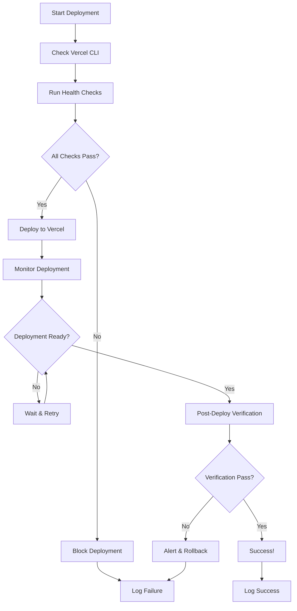

# 🛡️ Guardian Deployment Health Guide

**Comprehensive guide for ensuring safe, reliable deployments to Vercel with automated health checks and monitoring.**

---

## 📋 Table of Contents

1. [Overview](#overview)
2. [Prerequisites](#prerequisites)
3. [Guardian Scripts](#guardian-scripts)
4. [Deployment Workflow](#deployment-workflow)
5. [Health Checks](#health-checks)
6. [Troubleshooting](#troubleshooting)
7. [Best Practices](#best-practices)
8. [Integration with CI/CD](#integration-with-cicd)

---

## 🎯 Overview

The Guardian Deployment Health system ensures that every deployment to Vercel is safe, reliable, and thoroughly tested. It provides:

- **Pre-deployment validation** - Build, bundle size, and critical page testing
- **Deployment monitoring** - Real-time status tracking and error detection
- **Post-deployment verification** - Live site testing and performance validation
- **Comprehensive logging** - Full audit trail of all deployment activities

### Key Benefits

✅ **Zero-downtime deployments** - Only deploy when all checks pass  
✅ **Automated testing** - Puppeteer-based critical page validation  
✅ **Performance monitoring** - Bundle size and loading time tracking  
✅ **Rollback safety** - Failed deployments are blocked automatically  
✅ **Full audit trail** - Complete logs for compliance and debugging  

---

## Prerequisites

### Required Tools

```bash
# Node.js 20.19.6+ (already configured in .nvmrc)
source ~/.nvm/nvm.sh && nvm use

# Vercel CLI (global installation)
npm install -g vercel

# Login to Vercel (one-time setup)
vercel login

# Optional: allow CI/automation to bypass Vercel protection
export VERCEL_AUTOMATION_BYPASS_SECRET="<current secret>"
```

> **Why the bypass secret matters**
>
> If production deployments are protected (password/SSO), automated checks must present the same bypass token that Vercel exposes as `VERCEL_AUTOMATION_BYPASS_SECRET`. Keep this secret in your shell/CI env so the guardian scripts can attach the required header when they verify deployments.

### Project Dependencies

Ensure these packages are installed in your project:

```json
{
  "devDependencies": {
    "playwright": "^1.40.0",
    "@playwright/test": "^1.40.0",
    "typescript": "^5.0.0"
  }
}
```

Install with:
```bash
npm install --save-dev playwright @playwright/test
npx playwright install
```

---

## Guardian Scripts

### 1. Deployment Health Check

**File**: `scripts/guardian/deploymentHealthCheck.ts`

**Purpose**: Comprehensive pre-deployment validation

**Usage**:
```bash
npm run guardian:health-check
```

**What it checks**:
- Build success (`npm run build`)
- Bundle size analysis (warn > 500KB, fail > 1MB)
- Critical page functionality (5 core pages)
- Console error detection
- React hydration validation
- Performance metrics collection

**Output**: `test-results/guardian-health-check.json`

### 2. Vercel Deployment Guard

**File**: `scripts/guardian/vercelDeploymentGuard.ts`

**Purpose**: End-to-end safe deployment pipeline

**Usage**:
```bash
npm run guardian:deploy-guard
```

**What it does**:
1. Validates Vercel CLI and authentication
2. Runs pre-deployment health checks
3. Deploys to Vercel production
4. Monitors deployment status
5. Runs post-deployment verification
6. Logs all activities

**Output**: `test-results/guardian-deployment-log.json`

---

## Deployment Workflow

### Safe Deployment Process



### Step-by-Step Instructions

#### 1. Pre-Deployment Preparation

```bash
# Ensure clean working directory
git status
git pull origin main

# Run local development server
npm run dev
```

#### 2. Health Check Validation

```bash
# Run comprehensive health checks
npm run guardian:health-check

# Review results
cat test-results/guardian-health-check.json
```

#### 3. Safe Deployment

```bash
# Execute full deployment guard (ensure bypass secret is exported if protection is enabled)
export VERCEL_AUTOMATION_BYPASS_SECRET="<current secret>"
npm run guardian:deploy-guard

# Monitor progress in real-time
# Script will provide live updates
```

> **Automation Note**: the deploy guard automatically attaches the header `x-vercel-protection-bypass: $VERCEL_AUTOMATION_BYPASS_SECRET` while polling the deployed URL, so the regression monitor doesn’t trip on 401 errors.

#### 4. Post-Deployment Verification

```bash
# Check deployment logs
cat test-results/guardian-deployment-log.json

# Manual verification (optional)
curl https://your-app.vercel.app
```

---

## 🔍 Health Checks

### Build Validation

**Checks**:
- TypeScript compilation
- Vite build success
- Asset generation
- No build warnings/errors

**Thresholds**:
- Build time: < 30 seconds
- No TypeScript errors
- No ESLint critical errors

### Bundle Size Analysis

**Checks**:
- Main bundle size
- Asset optimization
- Code splitting effectiveness

**Thresholds**:
- ⚠️ Warning: > 500KB
- ❌ Fail: > 1MB
- ✅ Good: < 300KB

### Critical Page Testing

**Pages Tested**:
1. `/` - Home/Landing page
2. `/balancer` - Config-Driven Balancer
3. `/idle-village` - Idle Village Map
4. `/punch-club` - Punch Club
5. `/sts` - STS Tools

**Validation Criteria**:
- Page loads successfully (HTTP 200)
- No console errors
- No React hydration errors
- Critical elements present
- Load time < 5 seconds

### Performance Metrics

**Collected Metrics**:
- DOM Content Loaded time
- Complete load time
- First paint time
- Bundle size
- Page weight

**Benchmarks**:
- DOM Content Loaded: < 2 seconds
- Complete load: < 5 seconds
- First paint: < 1.5 seconds

---

## 🚨 Troubleshooting

### Common Issues

#### Build Failures

**Problem**: `npm run build` fails
```
❌ Build Verification: Command failed: Build failed with exit code 1
```

**Solutions**:
1. Check TypeScript errors:
   ```bash
   npx tsc --noEmit
   ```

2. Fix ESLint errors:
   ```bash
   npm run lint:fix
   ```

3. Check for missing dependencies:
   ```bash
   npm install
   ```

#### Page Test Failures

**Problem**: Puppeteer page tests fail
```
❌ Home Page: Page failed to load (status: 500)
```

**Solutions**:
1. Start dev server:
   ```bash
   npm run dev
   ```

2. Check page manually:
   ```bash
   curl http://localhost:3000/
   ```

3. Review console errors in browser

#### Vercel Deployment Issues

**Problem**: Vercel deployment fails
```
❌ Deployment failed: Build failed
```

**Solutions**:
1. Check Vercel build logs:
   ```bash
   vercel logs
   ```

2. Verify environment variables:
   ```bash
   vercel env ls
   ```

3. Check build configuration in `vercel.json`

#### Protected Deployment (401) Failures

**Problem**: Deployments succeed but the CI regression monitor or manual checks hit `401 Unauthorized` because the site is protected.

**Solutions**:
1. Export the automation bypass secret before running guardian scripts:
   ```bash
   export VERCEL_AUTOMATION_BYPASS_SECRET="<current secret>"
   npm run guardian:deploy-guard
   ```
2. For manual curls/tests, include the header:
   ```bash
   curl -I -H "x-vercel-protection-bypass: $VERCEL_AUTOMATION_BYPASS_SECRET" https://<deploy>.vercel.app
   ```
3. Rotate the secret in Vercel (Project → Settings → Security) and update local/CI env vars if the current token is compromised.

### Recovery Procedures

#### Failed Deployment Recovery

1. **Identify failure point**:
   ```bash
   # Check deployment logs
   cat test-results/guardian-deployment-log.json | tail -1
   ```

2. **Fix the issue**:
   - Build errors: Fix code/dependencies
   - Page errors: Fix UI components
   - Vercel errors: Check configuration

3. **Re-run deployment**:
   ```bash
   npm run guardian:deploy-guard
   ```

#### Manual Rollback

If deployment succeeds but causes issues:

1. **Identify last good commit**:
   ```bash
   git log --oneline -10
   ```

2. **Rollback**:
   ```bash
   git reset --hard <commit-hash>
   npm run guardian:deploy-guard
   ```

---

## 💡 Best Practices

### Development Workflow

1. **Feature Branch Development**:
   ```bash
   git checkout -b feature/new-feature
   # Develop and test locally
   npm run dev
   ```

2. **Pre-Merge Validation**:
   ```bash
   npm run guardian:health-check
   npm run test:all
   ```

3. **Merge and Deploy**:
   ```bash
   git checkout main
   git merge feature/new-feature
   npm run guardian:deploy-guard
   ```

### Monitoring and Alerts

1. **Regular Health Checks**:
   ```bash
   # Schedule in CI/CD
   npm run guardian:health-check
   ```

2. **Log Monitoring**:
   ```bash
   # Check recent deployments
   tail -n 5 test-results/guardian-deployment-log.json
   ```

3. **Performance Tracking**:
   - Monitor bundle size trends
   - Track page load times
   - Set up alerts for failures

### Code Quality

1. **Prevent Build Issues**:
   - Use TypeScript strictly
   - Fix ESLint warnings immediately
   - Keep dependencies updated

2. **Optimize Bundle Size**:
   - Use dynamic imports for large components
   - Optimize images and assets
   - Enable code splitting

3. **Page Performance**:
   - Lazy load non-critical components
   - Optimize images and fonts
   - Use React.memo appropriately

---

## 🔄 Integration with CI/CD

### GitHub Actions Example

```yaml
name: Guardian Deployment

on:
  push:
    branches: [main]

jobs:
  deploy:
    runs-on: ubuntu-latest
    steps:
      - uses: actions/checkout@v3
      
      - name: Setup Node.js
        uses: actions/setup-node@v3
        with:
          node-version: '20.19.6'
          
      - name: Install dependencies
        run: npm ci
        
      - name: Install Playwright
        run: npx playwright install
        
      - name: Run Guardian Health Check
        run: npm run guardian:health-check
        
      - name: Deploy to Vercel
        run: npm run guardian:deploy-guard
        env:
          VERCEL_TOKEN: ${{ secrets.VERCEL_TOKEN }}
          VERCEL_ORG_ID: ${{ secrets.VERCEL_ORG_ID }}
          VERCEL_PROJECT_ID: ${{ secrets.VERCEL_PROJECT_ID }}
```

### Environment Setup

Required Vercel secrets:
- `VERCEL_TOKEN` - Vercel API token
- `VERCEL_ORG_ID` - Organization ID
- `VERCEL_PROJECT_ID` - Project ID

Get these values:
```bash
vercel link
vercel projects ls
```

---

## 📊 Metrics and Monitoring

### Key Performance Indicators

| Metric | Target | Measurement |
|--------|--------|-------------|
| Build Success Rate | 100% | Build failures per deployment |
| Bundle Size | < 500KB | Main bundle size in KB |
| Page Load Time | < 5s | Average page load time |
| Deployment Time | < 10min | Time from start to live |
| Error Rate | 0% | Console/page errors |

### Monitoring Dashboard

Create a simple dashboard to track metrics:

```typescript
// scripts/guardian/metricsDashboard.ts
interface DeploymentMetrics {
  timestamp: string;
  buildTime: number;
  bundleSize: number;
  pageLoadTime: number;
  success: boolean;
}

// Generate weekly reports
// Track trends over time
// Alert on regressions
```

---

## 🔧 Configuration

### Custom Health Checks

Extend `deploymentHealthCheck.ts` to add custom checks:

```typescript
// Add custom check method
private async checkCustomMetrics(): Promise<HealthCheckResult> {
  // Implement your custom validation
  return {
    status: 'pass',
    category: 'Custom',
    test: 'Custom Check',
    message: 'Custom validation passed',
    duration: 100
  };
}

// Add to runHealthChecks method
const customResult = await this.checkCustomMetrics();
this.results.push(customResult);
```

### Page Test Configuration

Modify critical pages list:

```typescript
private config = {
  criticalPages: [
    { path: '/', name: 'Home Page' },
    { path: '/custom-page', name: 'Custom Page' }, // Add new page
    // ... other pages
  ]
};
```

### Threshold Adjustment

Configure size and performance thresholds:

```typescript
const thresholds = {
  bundleSize: {
    warn: 300, // Lower warning threshold
    fail: 800  // Lower failure threshold
  },
  pageLoad: {
    warn: 3000, // 3 seconds
    fail: 8000  // 8 seconds
  }
};
```

---

## 📝 Maintenance

### Regular Tasks

1. **Weekly**:
   - Review deployment logs
   - Check bundle size trends
   - Update dependencies

2. **Monthly**:
   - Review and update health checks
   - Optimize bundle size
   - Update Puppeteer browsers

3. **Quarterly**:
   - Review deployment strategy
   - Update CI/CD configuration
   - Audit security settings

### Script Updates

Keep Guardian scripts updated:

```bash
# Update dependencies
npm update

# Update Playwright browsers
npx playwright install

# Test scripts locally
npm run guardian:health-check
```

---

## 🆘 Support

### Getting Help

1. **Check logs first**:
   ```bash
   cat test-results/guardian-health-check.json
   cat test-results/guardian-deployment-log.json
   ```

2. **Run individual checks**:
   ```bash
   npm run build
   npm run lint
   npm run test
   ```

3. **Manual verification**:
   ```bash
   npm run dev
   # Test pages manually
   ```

### Common Commands

```bash
# Quick health check
npm run guardian:health-check

# Full deployment
npm run guardian:deploy-guard

# Check recent deployments
cat test-results/guardian-deployment-log.json | jq '.[-1]'

# Monitor bundle size
npm run build && du -sh dist/*
```

---

## 🆘 Vercel Deployment Troubleshooting

### Common Issues & Solutions

When Vercel deployment fails but local build succeeds:

#### Node Version Mismatch
```bash
# Fix .nvmrc
echo "20.19.6" > .nvmrc

# Update vercel.json
{
  "build": {
    "env": {
      "NODE_VERSION": "20.19.6"
    }
  }
}
```

#### Functions vs Builds Conflict
```bash
# Error: The `functions` property cannot be used in conjunction with the `builds` property
# Solution: Remove `builds` property, keep only `functions` or vice versa
```

#### Build Command Issues
```bash
# Use npm ci instead of npm install
"installCommand": "npm ci",
"buildCommand": "npm run build"
```

### Quick Fix Template
```bash
# 1. Fix Node version
echo "20.19.6" > .nvmrc

# 2. Clean rebuild
rm -rf dist node_modules package-lock.json
npm install
npm run build

# 3. Fix vercel.json conflicts
# 4. Deploy
vercel --prod
```

### Debug Commands
```bash
# Check Vercel logs
vercel logs

# Verify configuration
vercel info

# Test with debug output
vercel --debug

# Check environment variables
vercel env ls
```

**Complete Guide**: See `docs/operations/vercel_deploy_troubleshooting.md` for comprehensive troubleshooting.

---
